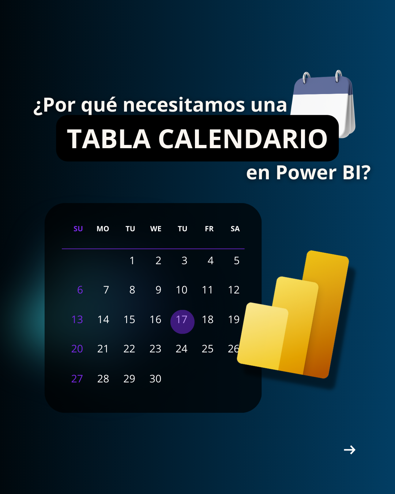

# Calendar Tables in DAX

## Overview

While data modeling in Power BI, having a robust and flexible calendar table is essential. A calendar table, or date dimension, allows for consistent and accurate time-based analysis. It enables users to perform calculations such as year-over-year growth, month-to-date sales, or quarter comparisons, which are crucial for insightful reporting and data analysis. This repository provides examples of calendar tables in DAX, one in English and another in Spanish, to assist you in building and customizing your own date dimension table.

## More Information
For more information about calendar tables and their importance, click the link below (content in Spanish):
[Más información sobre tablas calendario y su importancia aquí](https://www.instagram.com/p/C01j3zQthI9/?img_index=1)

<a href="https://www.instagram.com/p/C01j3zQthI9/?img_index=1">
  
</a>

## Benefits of Using Calendar Tables
- 📅 Enables time intelligence functions (e.g., year-to-date, quarter-to-date).
- 📊 Simplifies date-based calculations and reporting.
- 🚀 Improves the performance of your data model.
- 🔍 Provides a unified date reference for all your tables.


## English Calendar Table 
```bash
dCalendar = 

VAR MinYear =
    YEAR(MIN('Table'[Date]))
    
VAR MaxYear =
    YEAR(MAX('Table'[Date]))

VAR CalendarTable = 
    ADDCOLUMNS(
        FILTER(
            CALENDARAUTO(),
            YEAR([Date]) >= MinYear
                && YEAR([Date]) <= MaxYear
        ),
        "Year", YEAR([Date]),
        "Year-Month", YEAR([Date]) & "-" & FORMAT(MONTH([Date]), "00"),
        "Quarter Number", INT(FORMAT([Date], "q")),
        "Quarter", "Q" & INT(FORMAT([Date], "q")),
        "Month Number", MONTH([Date]),
        "Month Short", FORMAT([Date], "mmm"),
        "Semester", "S" & INT(IF(MONTH([Date]) >= 7, "2", "1")),
        "Week Number", WEEKNUM([Date]),
        "Week Day Number", WEEKDAY([Date], 2), // Week Starts Monday
        "Week Day Name", FORMAT([Date], "dddd"),
        "Short Week Day", FORMAT([Date],"ddd"),
        "Weekend", IF(WEEKDAY([Date], 2) IN {6, 7}, "Y", "N"),
        "In the last", SWITCH(
                TRUE(),
                DATEDIFF([Date], MAX(fImpressionsEngagements[Date]), DAY) <= 7, "7 Days",
                DATEDIFF([Date], MAX(fImpressionsEngagements[Date]), DAY) <= 15, "15 Days",
                DATEDIFF([Date], MAX(fImpressionsEngagements[Date]), DAY) <= 30, "30 Days",
                DATEDIFF([Date], MAX(fImpressionsEngagements[Date]), DAY) <= 45, "45 Days",
                DATEDIFF([Date], MAX(fImpressionsEngagements[Date]), DAY) <= 60, "60 Days",
                DATEDIFF([Date], MAX(fImpressionsEngagements[Date]), DAY) <= 90, "90 Days",
                DATEDIFF([Date], MAX(fImpressionsEngagements[Date]), DAY) <= 120, "120 Days",
                DATEDIFF([Date], MAX(fImpressionsEngagements[Date]), DAY) <= 180, "180 Days",
                "More than 180 Days"
                ),
        "Season", SWITCH(
                TRUE(),
                AND(
                    dCalendar[Month Number] >= 3,
                    dCalendar[Month Number] <= 5
                ), "Spring",
                AND(
                    dCalendar[Month Number] >= 6,
                    dCalendar[Month Number] <= 8
                ), "Summer",
                AND(
                    dCalendar[Month Number] >= 9,
                    dCalendar[Month Number] <= 11
                ), "Fall",
                "Winter"
            )
        
)

RETURN
CalendarTable
```
    
## Spanish Calendar Table
```bash
dCalendario = 

VAR MinYear =
    YEAR(MIN('Table'[Date]))
    
VAR MaxYear =
    YEAR(MAX('Table'[Date]))

VAR TablaCalendario =
    ADDCOLUMNS(
        FILTER(
            CALENDARAUTO(),
            YEAR([Date]) >= MinYear
                && YEAR([Date]) <= MaxYear
        ),
        "Año", YEAR([Date]),
        "Año-Mes", YEAR([Date]) & "-" & MONTH([Date]),
        "#Trimestre", INT(FORMAT([Date], "q")),
        "Trimestre", "T" & INT(FORMAT([Date], "q")),
        "#Mes", MONTH([Date]),
        "Mes", FORMAT([Date], "MMM"),
        "Semestre", "S" & INT(IF(MONTH([Date]) >= 7, "2", "1")),
        "Semana", WEEKNUM([Date]),
        "#Día Semana", WEEKDAY([Date], 2), // Semana Comienza Lunes y Termina Domingo
        "Día Semana", FORMAT([Date], "dddd"),
        "Nombre Corto Día Semana", FORMAT([Date], "ddd"),
        "Fin de Semana", IF(WEEKDAY([Date], 2) IN {6, 7}, "Si", "No"),
        "En los últimos", 
            SWITCH(
                TRUE(),
                DATEDIFF([Date], MAX(fImpressionsEngagements[Date]), DAY) <= 7, "7 Días",
                DATEDIFF([Date], MAX(fImpressionsEngagements[Date]), DAY) <= 15, "15 Días",
                DATEDIFF([Date], MAX(fImpressionsEngagements[Date]), DAY) <= 30, "30 Días",
                DATEDIFF([Date], MAX(fImpressionsEngagements[Date]), DAY) <= 45, "45 Días",
                DATEDIFF([Date], MAX(fImpressionsEngagements[Date]), DAY) <= 60, "60 Días",
                DATEDIFF([Date], MAX(fImpressionsEngagements[Date]), DAY) <= 90, "90 Días",
                DATEDIFF([Date], MAX(fImpressionsEngagements[Date]), DAY) <= 120, "120 Días",
                DATEDIFF([Date], MAX(fImpressionsEngagements[Date]), DAY) <= 180, "180 Días",
                "Más de 180 Días"
            ),
        "Temporada", SWITCH(
                TRUE(),
                AND(
                    dCalendar[Month Number] >= 3,
                    dCalendar[Month Number] <= 5
                ), "Otoño",
                AND(
                    dCalendar[Month Number] >= 6,
                    dCalendar[Month Number] <= 8
                ), "Invierno",
                AND(
                    dCalendar[Month Number] >= 9,
                    dCalendar[Month Number] <= 11
                ), "Primavera",
                "Verano"
            )
    )

RETURN
TablaCalendario
```

## Notes
- The above calendar tables include common columns such as year, month, quarter, and day information, which are frequently used in time-based analysis.

- These tables can be extended to include additional custom columns or to exclude columns that are not needed for your specific analysis.

- Customizations might include fiscal year information, holiday flags, special event markers, or any other date-related data that is relevant to your business needs.
