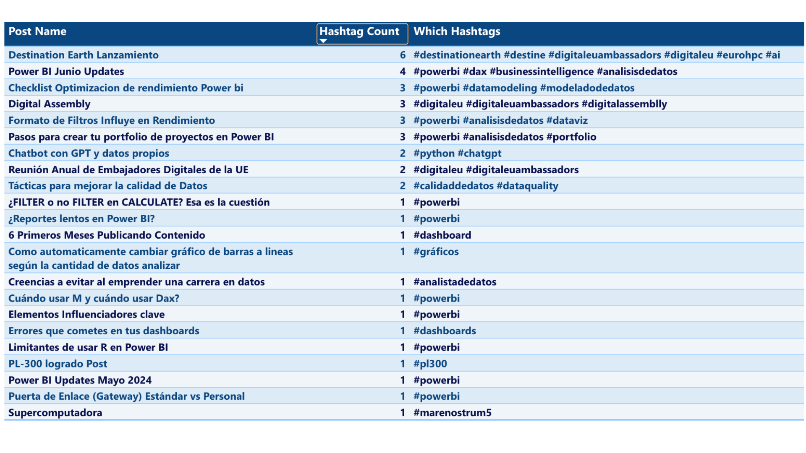

# Count Frequency of a Symbol or String in a Text Column 

## Overview
This repository provides a formula to count the frequency of a specific symbol or substring within a column of a table. The purpose of this formula is to efficiently tally the instances of a particular symbol within textual data, aiding in various data analysis tasks.





## DAX Code - For A Symbol 
Add a calculated column with the following code. Change "@" for the symbol you need to count ocurrences.

```bash
Get Count Of One Symbol = 
LEN(YourTable[YourColumn]) - LEN(SUBSTITUTE(YourTable[YourColumn], "@", ""))
```

## DAX Code - For A String 
Add a calculated column with the following code. Change "string" for the string you need to count ocurrences, for example "https://".

```bash
Get Count Of String = 
DIVIDE(
    LEN(YourTable[YourColumn]) - LEN(SUBSTITUTE(YourTable[YourColumn], "STRING", "")),
    LEN("STRING")
)
```

## Case Studies or Examples of Concrete and Concise Business Use Cases
📊 Social Media Analysis: Counting occurrences of @ to analyze mentions in social media posts.

📈 Web Traffic Analysis: Analyzing web server logs to quantify visits to URLs starting with "http://".

📄 Text Mining: Identifying and categorizing documents based on the frequency of specific symbols or strings.

🎯 SEO Analysis: Calculating the density of certain keywords or symbols in web content.

🔍 Email Analysis: Counting the frequency of @ in email addresses to validate format consistency.

🛠️ Data Cleansing: Identifying and correcting inconsistencies in data where a specific string should appear.


## Author
[@jenmiraba](https://github.com/jenmiraba)


