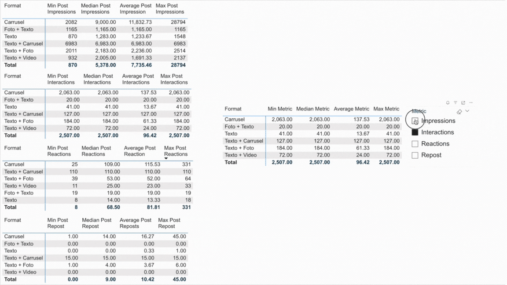
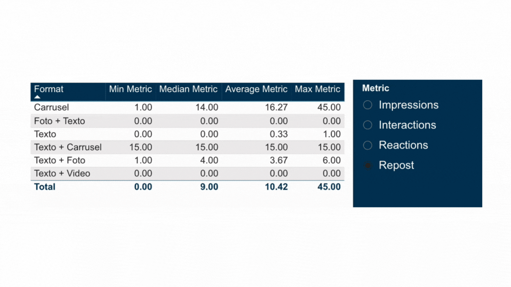
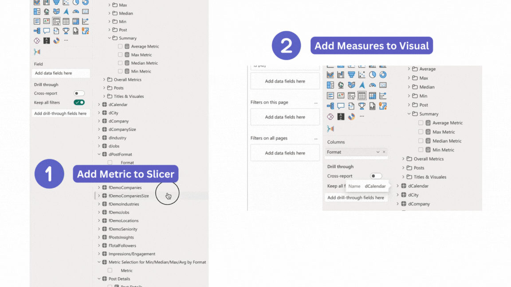

# Dynamic Metric Selection in Power BI to Avoid Bookmarks
&nbsp;
## Overview
This repository contains a Power BI solution for dynamically selecting and displaying different metrics using a single visual and **no field parameters**. This approach could replace the need for multiple bookmarks, and saving space without losing interactivity.

The solution addresses this by:
- Consolidating multiple metrics into a single, dynamic visual
- Allowing users to select which metric to display on-the-fly
- Calculating statistical measures based on the selected metric

#### From this:
  

#### To this:  
  


## Problem Description

In traditional Power BI reports, you might need to create separate visuals for each metric (for example, one for Impressions, another for Interactions, for Reactions, Repost and so on) to display measures (such as minimum, median, average, and maximum values) for each and every one of those. 

This approach can lead to cluttered dashboards and a less interactive experience.

Therefore, instead of creating separate visualizations for each metric, we consolidate them into a single, dynamic chart by using a dynamic metric selection. This not only saves space but also improves data exploration and user experience.  

&nbsp;  
## Examples of Use Cases

📊 **Single Visual for Multiple Metrics**: Instead of having separate charts for different metrics, you can use a single visual that updates based on the selected metric. This reduces clutter and makes the report more interactive.

🛠️ **Enhanced Interactivity**: Users can select the desired metric from a dropdown, and the visual will dynamically update to show all relevant measure (min, median, average, or max) for that metric.

💾 **Space Efficiency**: Save valuable space on Power BI canvas by consolidating multiple metrics into one visual, making reports cleaner and more efficient.

&nbsp;

## Requirements

1. Have a table with the metrics for which we want to track different measures (such as min, max, median or average).

```bash
MetricSelection = 
DATATABLE(
    "Metric", STRING,
    {  
        {"Metric1"}, 
        {"Metric2"},  
        {"Metric3"},  
        {"Metric4"}   
    }  
)
```

2. Have the measures already defined in my data model. This is optional.

&nbsp;
## DAX Code

The following DAX code dynamically selects and displays the measure value for the selected metric. 

```bash
MeasureValue = 
VAR SelectedMetric = SELECTEDVALUE('MetricSelection'[Metric])

RETURN
SWITCH(
    TRUE(),
    SelectedMetric = "Metric1", [MeasureValueForMetric1]),
    SelectedMetric = "Metric2", [MeasureValueForMetric2]),
    SelectedMetric = "Metric3", [MeasureValueForMetric3]),
    SelectedMetric = "Metric4", [MeasureValueForMetric4]),
    BLANK()
)
```
&nbsp;
## DAX Example

I want to track the measures Min, Median, Average and Max for 4 different metrics: Impressions, Interactions, Reactions and Reposts.

The approach for this measure should be extended to include median, average, and maximum values as well, or any other measure relevant for the analysis.

```bash
Min Measure = 
VAR SelectedMetric = SELECTEDVALUE('Metric Selection for Min/Median/Max/Avg by Format'[Metric])

RETURN
SWITCH(
    TRUE(),
    SelectedMetric = "Impressions", [Min Post Impressions],
    SelectedMetric = "Interactions", [Min Post Interactions],
    SelectedMetric = "Reactions", [Min Post Reactions],
    SelectedMetric = "Repost", [Min Post Repost],
    BLANK()
)
```
&nbsp;  
## Next Steps




&nbsp;  
## Notes
**Extend the Measure:**  
To include other measures (for the example, median, average, and maximum values), create additional measures using similar logic and update the SWITCH statement accordingly.

**Configure Slicer:**  
Add the MetricSelection table to your report and use it as a slicer to allow users to select the metric. Otherwise you'll see blanks.

**Update Visuals:**  
Use the dynamic measures in your visuals to ensure they update based on the selected metric.

**Data Model:**  
Ensure your data model includes the necessary tables, columns and measures as referenced in the DAX code. Consider performance implications when working with large datasets.


&nbsp;
## Author
[@jenmiraba](https://github.com/jenmiraba)


