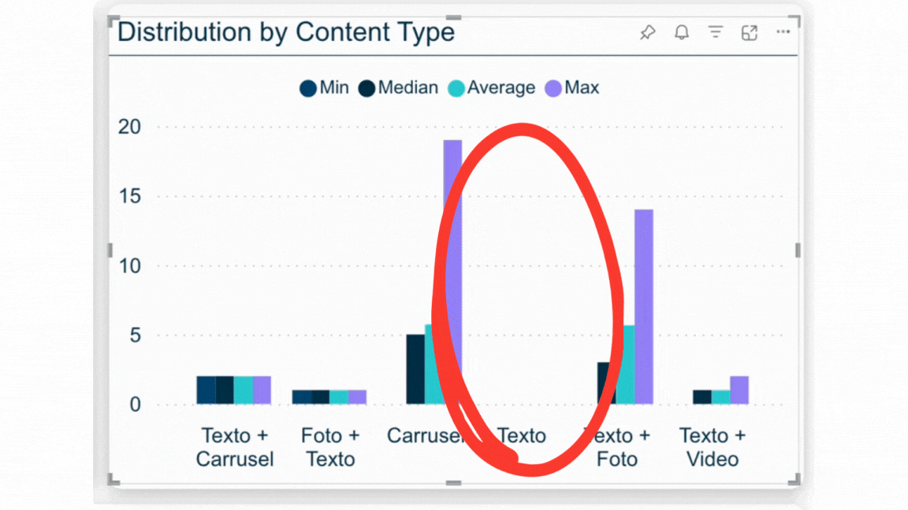
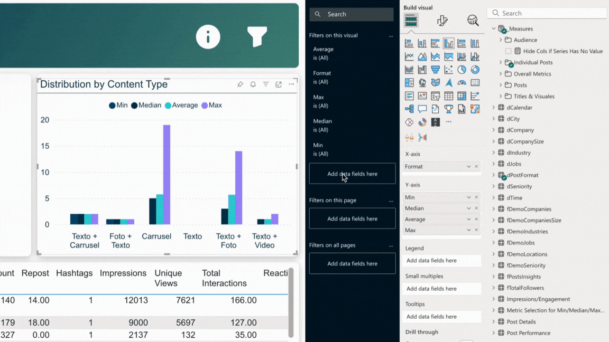

# Dynamic DAX Filter for Hiding Zero-Value Series in Power BI

## Overview
This repository addresses a common issue in Power BI visualizations: the presence of unwanted blank or zero-value series in charts. While it might be tempting to simply filter out all zero values, this approach can inadvertently hide important data. This solution provides a dynamic DAX formula to hide series only when all measures for that series are zero.

&nbsp;

  

&nbsp;

## Problem Description

When creating visualizations in Power BI, is easy to encounter categories or series that have no value across all measures, cluttering the chart. A naive approach of filtering out all zero values can lead to unintended data loss. This solution aims to hide a series only when it has zero values for all measures, while ensuring that series with at least one non-zero measure remain visible.

&nbsp;

## Example of Case Studies 📊

**Product Performance Dashboard** 🏷️   
Hide product categories with no sales across all metrics without losing partial data.  

**Inventory Management**: 📦  
Identify categories with zero movement across multiple stock metrics.

**Employee Productivity Tracker** 👩‍💼👨‍💼  
Streamline department performance views by hiding inactive departments without risking data omission.  

**Financial Report** 💰  
Cleanly present account statements by hiding zero-balance accounts while retaining accounts with activity in any   financial measure.

**Healthcare Monitoring**: 🩺   
Track patient metrics, only showing those with significant medical readings.


&nbsp;

## Dax Code

```dax
Hide Cols if Series Has No Value = 
VAR _Measure1Value = IF([Measure1] = 0, 0, 1)
VAR _Measure2Value = IF([Measure2] = 0, 0, 1)
VAR _Measure3Value = IF([Measure3] = 0, 0, 1)
VAR _Measure4Value = IF([Measure4] = 0, 0, 1)

VAR _Total = _Measure1Value + _Measure2Value + _Measure3Value + _Measure4Value

RETURN
IF(
    _Total = 0,
    0,
    1
)
```
&nbsp;
## DAX Example

```bash
Hide Cols if Series Has No Value = 
VAR _MinValue = IF([Min Metric] = 0, 0, 1)
VAR _MedianValue = IF([Median Metric] = 0, 0, 1)
VAR _AverageValue = IF([Average Metric] = 0, 0, 1)
VAR _MaxValue = IF([Max Metric] = 0, 0, 1)

VAR _Total = _MinValue + _MedianValue + _AverageValue + _MaxValue

RETURN
IF(
    _Total = 0,
    0,
    1
)
```
&nbsp;

## Next Steps
Apply this measure as a visual-level filter, setting it to show only when the result is 1.

&nbsp;



&nbsp;

## Notes
- Adjust the measure names in the formula to match your specific measures.
- Add or remove VAR lines as needed, depending on the number of measures you're evaluating.
- This approach ensures that a series is hidden only when all its measures are zero, providing a more accurate and dynamic filtering method.
&nbsp;

## Author
[@jenmiraba](https://github.com/jenmiraba)


